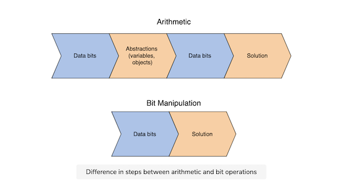
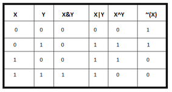
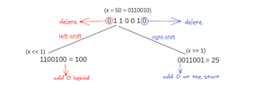

# Bit manipulation

* Bit manipulation is the act of algorithmically manipulating bits using bit-level (bitwise) operations. These bitwise
  operations are the heart of bit manipulation. They are primitive, fast actions that are used in improving the
  efficiency of a program.
* Bit manipulation is the process of applying logical operations on a sequence of bits, the smallest form of data in a
  computer, to achieve a required result. Bit manipulation has constant time complexity and process in parallel, meaning
  it is very efficient on all systems.

## Bitwise Operators

* While arithmetic operations perform operations on human-readable values (1+2), bitwise operators manipulate the
  low-level data directly.
  



## ^ Exclusive-or, Xor Operator

* The ^ operator (also known as the XOR operator) stands for Exclusive Or. Here, if bits in the compared position do not
  match its resulting bit is 1. This is efficient in checking for duplicates.

## Shift Operators

* These operators can be applied to integral types such as int, long, short, byte, or char.



* Left-Shift (<<) -> The left shift operator is denoted by the double left arrow key (<<). It is used to shift bits to
  the left: bits towards the left are removed and a zero is added to the right for every bit removed.
    * The number of times a bit is shifted left is denoted by the variable on the right in the below diagram: 1001 << n
    * Every bit shift left effectively doubles the value of the original bits. Here are a few examples to help you see
      how it works:
    * Note that shifting left is equivalent to multiplication by powers of 2.

```
6 << 1 → 6 * 2^1  → 6 * 2
6 << 3  → 6 * 2^3 → 6 * 8
```

* Right-Shift (>>)
    * The right shift operator is denoted by the double right arrow key (<<). It works by adding copies of the bit at
      the leftmost end in from the left, while removing the bits at the right. The resulting number is usually half of
      the initial number.

```
1011 >> 1 = 1101
1011>>1=1101

0011 >> 2 = 0000
0011>>2=0000
```

## Application of BIT Operators

* Bit operations are used for optimization of embedded systems.
* The Exclusive-or operator can be used to confirm the integrity of a file, making sure it has not been corrupted,
  especially after it has been in transit.
* Bitwise operations are used in Data encryption and compression.
* Bits are used in the area of networking, framing the packets of numerous bits which are sent to another system
  generally through any type of serial interface.
* Digital Image Processors use bitwise operations to enhance image pixels and to extract different sections of a
  microscopic image.

## Operations

```
1 + 1=10
1 + 0=1
0 + 0=0
1 + 1 + 1=11
1 -  0=1
1 -  1=0
```
